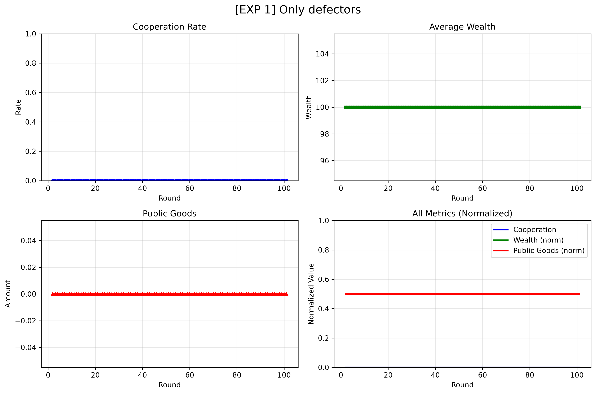
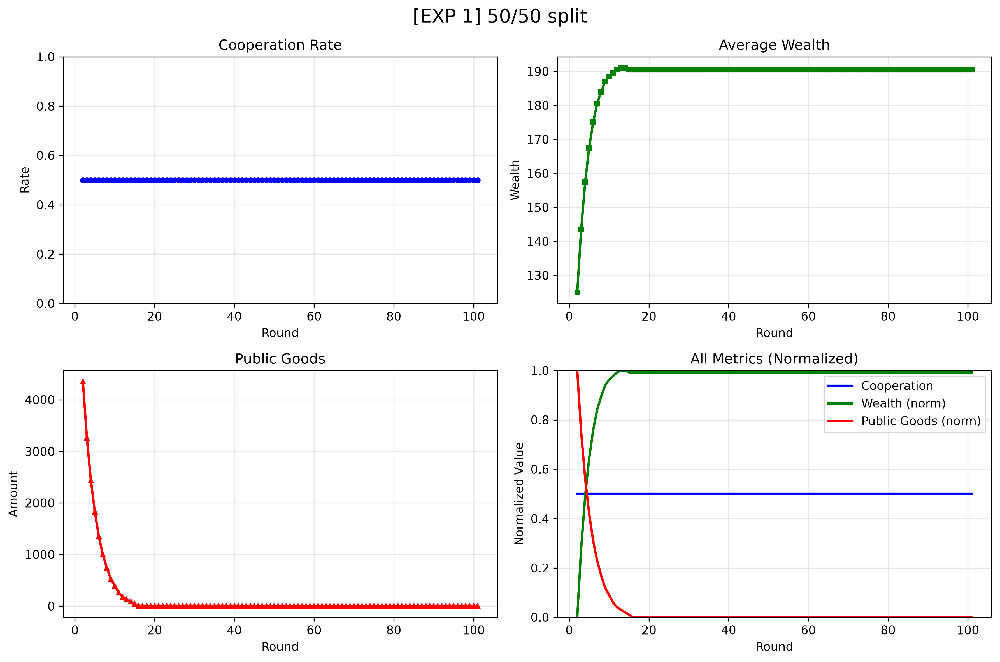
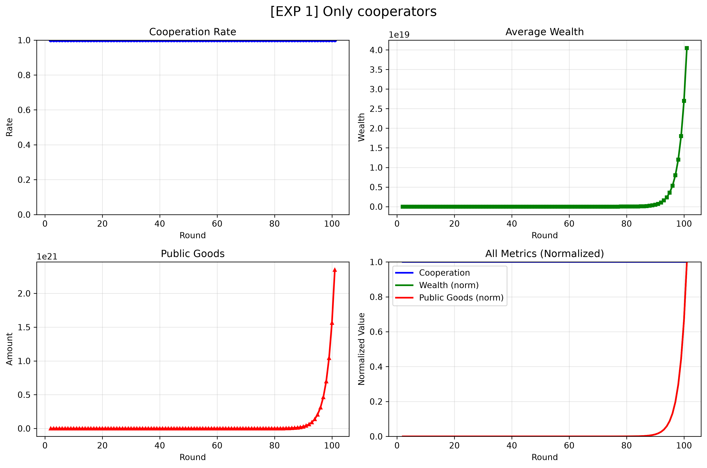
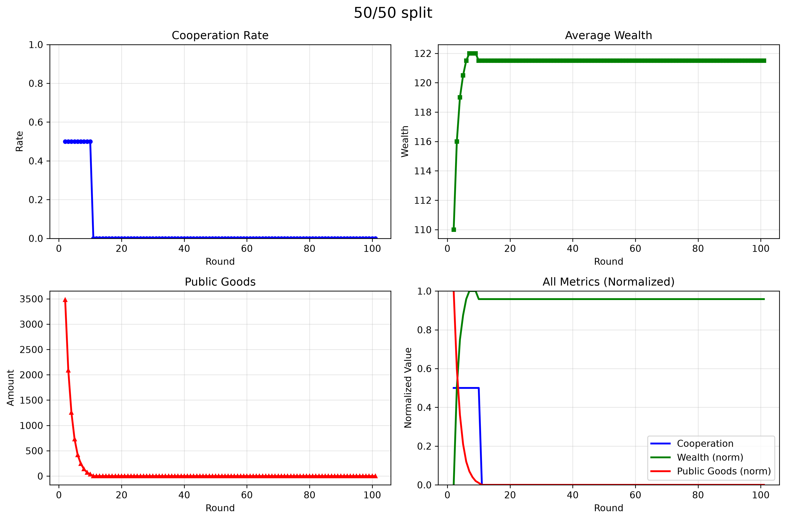
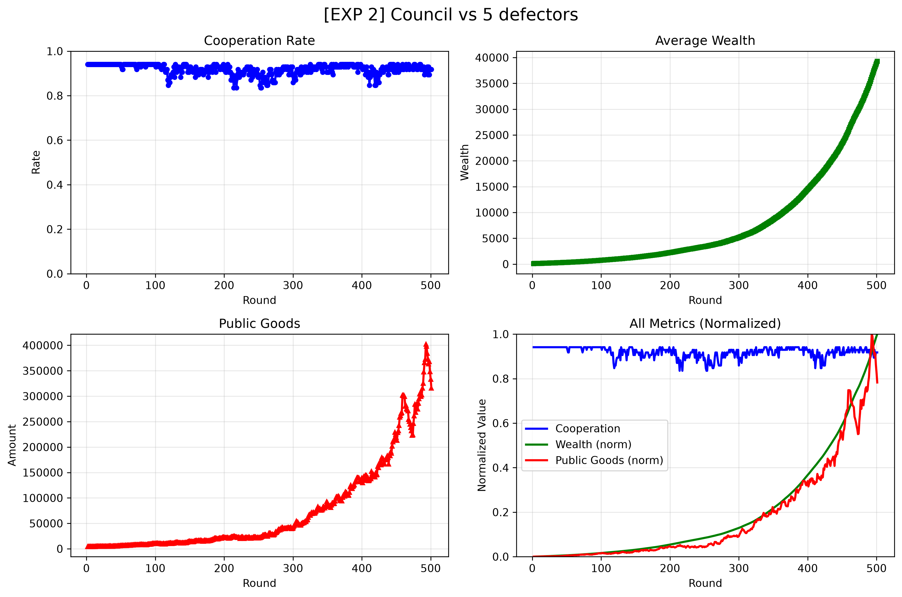
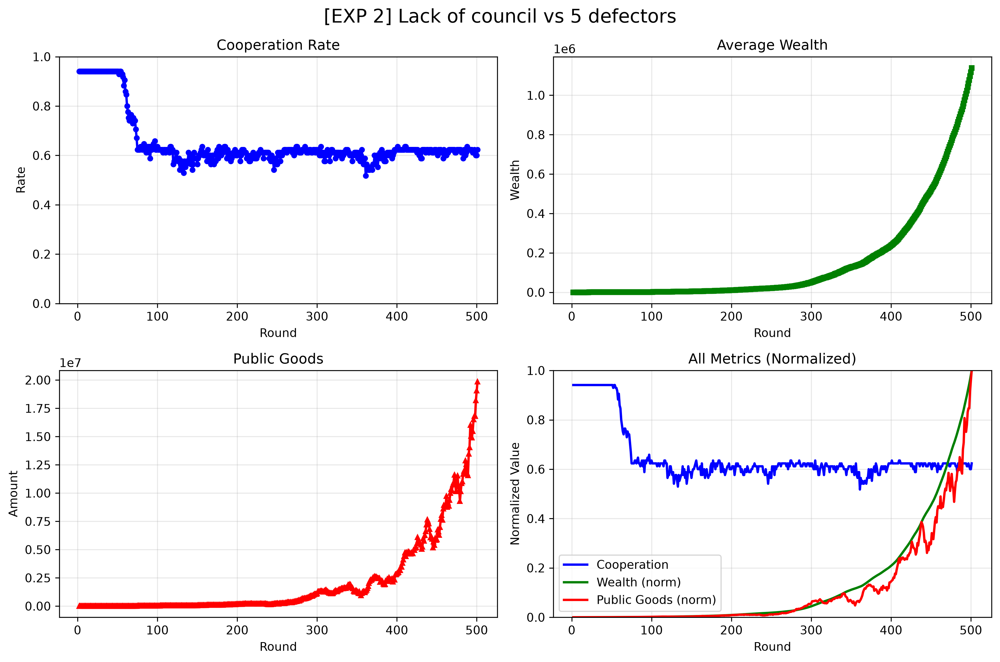
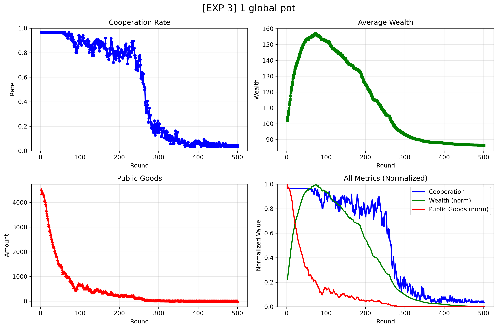
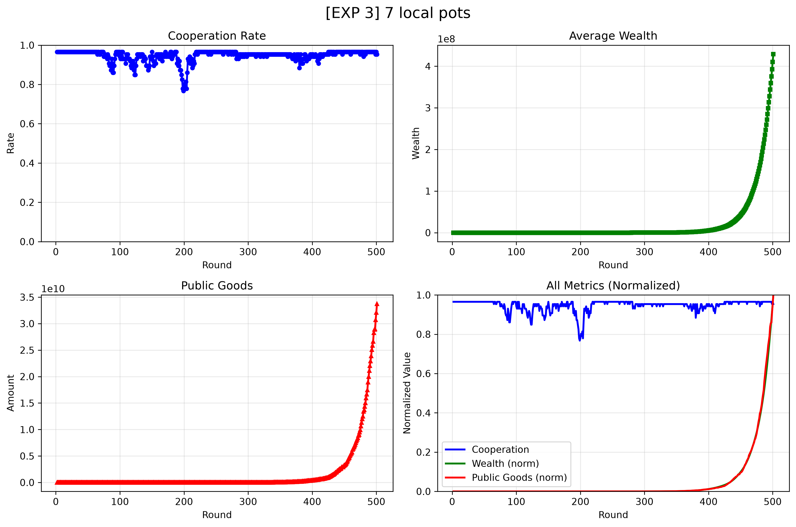

# Public Goods Game
This repository implements the Public Goods Game.

AI statement: a local model Quen3 4B 2507 was used solely for simple grammatical correction of README file. Although
very long, **the documentation is not AI-generated slop, so please read it ;)**

Mistral, Gemini 2.5 flash and Clause Sonnet 4.6
were employed to help with the implementation, but their help was mostly
conceptual and based on code refinement, designing project structure and finding errors.  However, there is esp. part
of the code that has been made by Mistral and is properly labelled.

## 1) Theoretical Introduction

### What is the Public Goods Game?

The Public Goods Game (PGG) is a classic in game-theoretical modelling — a framework for describing and analyzing people's behaviour, initiated by the famous book *Theory of Games and Economic Behavior* written by Morgenstern and von Neumann. Of course, the central concept of this framework is *a game* — a model of a situation that can be applied to many other situations with a similar structure. A game always has at least two players. The actions available to these players are called *strategies*. Based on their strategies, players receive *payoffs*, which are the outcomes of the game.

Trivially speaking, there are various games and various ways of classifying them. The type of games we are interested in are **simultaneous games with cooperation combined with agent-based modelling**. In simultaneous games, when a player makes a decision, she does not know all the factors that will determine the outcomes (e.g., the behaviour of other players). If a simultaneous game is also a cooperative one, then the outcome of the game heavily relies on relationships with others, since the payoff is distributed among all players.

The Public Goods Game applies this framework to model how people pay taxes, contribute to social services, etc. Thus, PGG can be described as follows: there is a number of players in the game. Each player starts with a certain sum of money (e.g., $20) and, in each turn, decides how much she would like to contribute to the public pot. The money from the pot is then multiplied by a factor (e.g., 2), divided by the number of players, and distributed equally among them. Of course, whether or not the PGG describes any actual phenomenon depends on what the public good is. Intuitively, a public good is one that can be shared by many agents (Kurz), such as public transport, street lighting, or radio waves.

### The Theory Behind Paying Taxes

There are a few important theoretical remarks we must make in order to understand PGG. Our approach to PGG focuses on **agent-based modelling**. Agents are autonomous, embedded in the environment, and interact with each other. The goal of each agent is to maximize her payoff. Of course, the best situation — speaking economically, not ethically — is the one when you do not contribute at all but still receive the payoff, since every other agent contributes.

This leads us to the state of the game called **Nash equilibrium** — a situation in which no player can unilaterally improve her outcome, since for every possible available strategy, the player will end up worse off or equally well compared to the original payoff (assuming that everyone else stays the same). Sadly, for public goods games, the only Nash equilibrium is the situation when no one contributes — the best response to any contribution is to take the money and leave.

Thus, how is it possible that people pay taxes? We have organized a complex system of rewards and punishments. We incentivize players to contribute, since free riding is severely punished.

If you are interested in how we modelled all of these phenomena, please refer to the technical documentation below.

## 2) Project Structure

This simulation is created within the Object-Oriented Programming paradigm. We believe that it is both intuitive and readable way of implementing the Public Goods Game.

### The Bird’s Eye View of the Project

The PGG was implemented with the following structure:

```
├── agents # keeps agent's implementation
│   ├── __init__.py
│   ├── agent.py
│   └── strategies.py
│
├── dynamics # interactions among agents 
│   ├── __init__.py
│   ├── council.py
│   ├── neighborhood.py
│   └── world.py
│
├── game # the core of simulation
│   ├── __init__.py
|   ├── stats.py
│   └── public_goods_game.py
│
├── tests # tests for basic compatibility
│   ├── __init__.py
│   ├── test_core_game.py
│   └── world_test.py
│
├── experiments2.ipynb
├── main.py
├── README.md
└── requirements.txt
```

### Detailed Description

#### Folder: `agents`

Agents are the basic elements of the game that interact with each other. Each agent is a class with a set of attributes. The most important ones are:  
* `identifier` — a unique ID of an agent  
* `endowment` — current amount of money of an agent  
* `contribution` — the amount of money that will be contributed to the public pot  
* `strategy` — the behaviour of an agent  

Agents can use various strategies. Some of them, such as `AlwaysCooperate` or `AlwaysDefect`, are self-explanatory and correspond to classical approaches outlined in Axelrod's tournaments. However, we also implemented an adaptive strategy. Since the key element of this strategy relies on other mechanisms, we will first explain other parts of the code.

#### Folder: `dynamics`

The folder `dynamics` keeps the vital mechanisms of the game. We now shall describe each of the most important classes.

Consider `world.py` as the board of this game. It is a 2D grid where the agents are placed.  
* Each agent is placed at X and Y coordinates.  
* Each grid cell stores its neighborhood ID.  
* Keeps the list of expelled agents.  

The world is represented as a grid populated with IDs. `#` are empty spaces.

```pycon
======================================================================
78388 96f81 6dc3f ce5e2 eaf66 11254 a115b 20e96 842ee a70f9 
6c364 6004d a9a72 9e591 a1723 f86af bece6 8b5b6 1a1cc #     
293a8 efdf5 191fc 2c34f 8e671 3b2e1 013b7 ace1e 60dba #     
e291a 28fcf #     dbf8d a9f5a 25be0 40eae ee575 517e1 54aff 
#     bfbaf 64fa8 #     9e32c #     f0b42 f7988 b6a11 6e277 
#     #     cea84 #     5445b 46687 29c95 7e4d3 82180 ef4a6 
ef732 396bb f5d64 26e55 ed1d1 6095f b0660 d8391 #     a72bb 
3532a 82d02 0f8ff 8a3d0 d7006 34c9c 3df95 e819e 0d48c #     
fe719 55f0c f12f2 e51f4 #     afcaf bb3f8 c6bc4 f065a #     
f3185 b796d #     a39fe 38145 fe9e2 #     c6dfa d493f 55af6 
======================================================================
```

The world is divided into neighborhoods (`neighborhood.py`) — groups of agents that can share a common pot with local communities, depending on the parameters of the world.  
* Each neighborhood is a connected region of the world with a separate pot.  
* Neighborhoods can expel and accept agents.  

The `council.py` consists of one of these systems of rewards and punishments that we mentioned in the introduction. It is a voting system that expels free-riders from the neighborhoods.  
* Within a certain neighborhood, agents hold votes to accept or expel an agent.  
* There is a `threshold` of votes (default = 5) that must be exceeded to expel someone. It means that in small neighborhoods it might be hard to expel someone, while in large neighborhoods it is very easy.  
* Agents vote for the lowest contributor in their `vote_sight` range, however only the votes within the neighborhood count. It means that an agent can vote for someone from another neighborhood, but the vote will be ignored.  
* The council accepts the richest expelled agent (if there is a place on the board).
 

#### Strategy: `AdaptiveStrategy`

##### Basic Principles

Since we outlined the core mechanisms of the game, we can now return to the `AdaptiveStrategy`. An agent that implements it learns from its neighbors by **adjusting contribution rate**. However, since we have a built-in voting mechanism, a naive imitation would be unreasonable. The richest agents are those who never contribute anything, so they get kicked out quickly.

Therefore, the adaptive agent computes **the risk of being voted out** for each of her neighbors — that is, the fraction of neighbors with higher contributions — and imitates only the neighbors whose risk is below 50%. Then, the agent adjusts her `contribution_rate` towards the richest neighbor with a learning rate of 0.2.  To ensure diversity in strategies, we introduced mutation mechanisms that occasionally alter an agent’s strategy parameters.

## 3) Experiments

In order to test the framework, we conducted a series of experiments. Please keep in mind that the framework was not created for one specific task. It is rather a game-theoretic experimental engine.

### Experiment I: A Simple Comparison of Communities (`experiment_1.py`)

To present how this framework works, we conducted a very simple study: a comparison between three groups of societies  
1. The society made solely from defectors (58 agents with `AlwaysDefect` strategy).  
2. 50/50 split: 29 `AlwaysDefect` agents and 29 `AlwaysCooperate` agents.  
3. The society made from 58 `AlwaysCooperate` agents.  

In all of these conditions, the agents were placed on an 8×8 grid within a single neighborhood (global pot = local pot). The worth-mentioning conditions of the study are the relatively high multiplication factor (`factor = 1.5`) and the absence of adaptive strategies, voting systems, and mutations. The results are available below:

  

The results are not surprising. Since all the strategies are fixed, we observe a stable percentage of cooperation throughout various games. Condition 1 (_Only defectors_) is a Nash equilibrium of the game — being an equilibrium does not guarantee being an optimal strategy.

It is worth mentioning that the average wealth in the second condition (50/50 split) is converging to a single point. That’s because only 50% of agents cooperate and the multiplication factor is just 1.5. A cooperative agent donates money, then it gets multiplied and distributed among all other agents. However, since only 50% cooperate, the amount of money that agents receive is progressively lower — cooperative agents have less and less money to donate. After a few rounds, they end up completely broke, so they *want* to cooperate, but they cannot donate anything.

Of course, one can claim that "If they donate 0, they do not cooperate." During the project we made a Kantian decision (_Nothing can possibly be conceived in the world, or even out of it, which can be called good, without qualification, except a good will._) — what matters is the *intention* of an agent, not the actual donation. Nevertheless, if we simply counted donations, the plot would look like this:




### Experiment II: Voting as a Defense Mechanism (`experiment_2.py`)

The problem of opportunistic communities is that they are very susceptible to degeneration. If your neighbor makes better income by cheating and there is no punishment, then what stops you from cheating? Thus, without a punishment mechanism, defective behaviour may easily spread in opportunistic communities.

To test this, we compared the impact of the voting mechanism on average cooperation throughout the game:  
1. The first community consisted of 5 `AlwaysDefect` agents and 80 `Adaptive` agents **without** voting mechanism, but with mutation.  
2. The second one consisted of 5 `AlwaysDefect` agents and 80 `Adaptive` agents **with** voting mechanism, but with mutation.  

In both conditions, the agents were distributed among 4 neighborhoods (the presence of neighborhoods is favourable for the voting mechanism). The results are visible below.

 

The voting mechanism works! Because defective agents are expelled from communities (and accepted by others), they cannot spread their defective strategy, and the average cooperation rate is higher.


### Experiment III: Local vs Global Pot (`experiment_2.py`)

How should we pay taxes? Which model is better? A global model where the whole society puts some money into the public pot, or a framework where you contribute to your local community? We conducted another experiment to test this.

We compared two communities:  
1. A single neighborhood community with 3 `AlwaysDefect`, 80 `Adaptive`, and 3 `AlwaysCooperate` agents.  
2. A set of 7 neighborhoods with 3 `AlwaysDefect`, 80 `Adaptive`, and 3 `AlwaysCooperate` agents.  

The multiplication factor was 1.05; councils and mutations were enabled. We noticed that the second community ended up better off, since multi-neighborhood worlds are better at using the voting mechanism. Moreover, the neighborhoods are isolated, which means that defective strategies are:  
i) harder to spread  
ii) get expelled faster.  

 


## 4) Closing Remarks and Controversies

There are two controversies arising from these experiments:  
1. Replicability is sometimes (especially in the case of Experiment II) not very strong, since the positions of agents are randomized.  
2. The key to the results is the voting mechanism. Since agents are expelled and reaccepted, in a 1-neighborhood environment we observe circular movement of agents — they are expelled, then wait, and are accepted again into the same neighborhood. We tried several different options to address this issue, but all of them led to the same situation we called a "collective panic attack". Since agents are constantly expelled, after a number of rounds we end up in a scenario where agents are organized into small, remotely located communities, with participation levels below the minimum voting threshold.

```pycon
========================================================
c715e 6a188 #     #     #     e8251 cbd76 98f11 
af829 91d5f #     #     #     8cabf #     285f9 
#     #     #     #     #     #     #     #     
#     #     #     #     #     #     #     #     
#     #     #     #     #     #     #     #     
#     #     #     #     #     #     5631a 8cd04 
#     50b9b #     #     #     #     #     9ffd5 
194d3 52504 d5ef2 #     #     #     5dc3f de989 
========================================================
```

We tried various strategies to address the problem: custom voting thresholds for each neighborhood and adding conditions such as "I will vote against the agent if he contributes less than me". Unfortunately, in adaptive communities, the between-subject variance is too high, and we always ended up with desolate, depopulated worlds. That's why we did not implement anything else for the 1-neighborhood scenario.

Thanks for reading! Pay your taxes ;) 